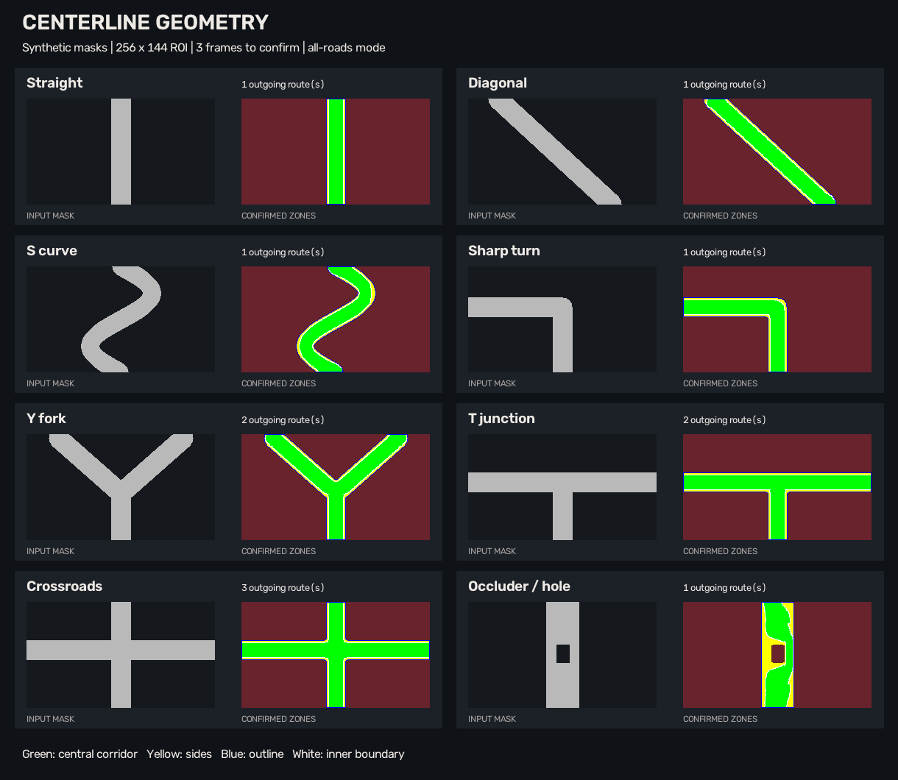

# Отчет о доработке ai_road

Дата: 8 сентября 2026 года. Основа: `triplekgod/ai_road`, commit `39cc93fe21bd4e26dcbbdddccdf59eb29d25a242`.

**Программная часть реализована и проверена локально. Приемка по реальной точности, устойчивости на карьерных видео и скорости целевого CPU остается открытой:** пользователь сообщил, что процессор, веса и датасет пока не определены. В поставке нет обученных весов.

## Что изменено

| Область handoff | Реализация |
|---|---|
| Прямоугольный вход и ROI | Единая предобработка 256×144 или 224×128, letterbox, ROI 0,20, обратное преобразование координат; старые checkpoint сохраняют исходную квадратную предобработку |
| Профилирование | Семь этапов и полная задержка с очередями; mean/median/p95, FPS и минимум по скользящим окнам, исключение прогрева, отчет JSON |
| Данные | Явный manifest с независимыми группами 70/15/15, аудит пар и бинарных масок, отрицательные кадры, проверка пересечений групп/путей/хешей |
| Обучение | Аугментации, loss с учетом размера batch, IoU/Dice/precision/recall/Boundary IoU/FPR, best validation IoU, resume с оптимизатором и эпохой, отдельный finetune |
| Оценка | Независимый full-frame test; одинаковые кадры и порог для сравнения моделей, происхождение данных и контроль ухудшения INT8 |
| Временная обработка | EMA, гистерезис, сбросы при смене видео/сцены/размера; историческое голосование сохранено |
| Геометрия | Скелет и граф на малом ROI, удаление шумовых ветвей, локальная ширина, коридоры по изгибу дороги, состояния candidate/confirmed/missing/removed; режимы all/main/legacy |
| Модели и ускорение | LiteRoadNet сохранена, добавлена FastSCNNLite; CPU PyTorch/ONNX Runtime/OpenVINO; ONNX и статический QDQ INT8, SHA256 metadata |
| Видео | Две ограниченные очереди 2–3 кадра; сохранение кадров для файла, удаление устаревших для камеры, проверка выходного FPS/числа кадров |
| Разметчик и меню | Несколько полигонов, вычитание, существующие маски, черная маска, undo, наложение, переход после сохранения, предупреждения о перезаписи; CLI и app.py |

Зеленые/желтые зоны ограничиваются **очищенной подтвержденной маской**. Очистка может заполнить маленький разрыв; это не гарантия правильности самой сегментации. Ветви API — исходящие маршруты от общего нижнего ствола: прямая 1, Y/T 2, крест 3. Основная гипотеза отображается сразу; дополнительные направления требуют подтверждения.

## Автоматические проверки

- `python -m pytest -q`: **95 passed, 19 subtests passed**, 0 ошибок, 0 пропусков. JUnit содержит 114 случаев с учетом подслучаев.
- Исходные два теста legacy-геометрии сохранены. Новые проверки покрывают S/диагональ/крутые повороты/Y/T/крест, разную ширину, края, шум, тень, перекрытие, пропуски ветвей, связность и ограничение зон маской.
- Проверены ROI/letterbox, EMA/гистерезис, смена сцены/размера, старые checkpoint, очереди камеры, порядок файловых кадров и завершение при ошибках.
- Проверены train → resume → evaluate на синтетических парах, batch-weighted loss, best score, утечки данных и защита входных файлов от совпадающих путей отчета.
- Реальные ONNX-экспорты обеих архитектур проверены в 256×144 и 224×128; ONNX Runtime и OpenVINO реально установлены, тесты не заменялись заглушками.
- Все 9 CLI проходят `--help`; `app.py` запускается и завершается вводом `0`. Логика разметчика проверена без открытия GUI; ручная работа мышью в живом окне не проходила отдельную пользовательскую приемку.
- `git diff --check`: без ошибок. В pytest остаются 10 предупреждений об устаревающем TorchScript ONNX exporter; выбранный экспорт работоспособен в проверенной версии PyTorch.

Перед публикацией локальные пути в отчетах заменены относительными обозначениями, имя компьютера скрыто; измеренные значения сохранены.

Исходные результаты: [pytest](reports/pytest.txt), [JUnit XML](reports/tests.xml), [сводка](reports/summary.json), [CLI](reports/cli_help.json).

## Численное соответствие и INT8

Проверка инструментов выполнена на **случайных необученных весах и синтетических изображениях**, не на карьерном test. Статическое INT8 калибровалось на 200 уникальных синтетических train-кадрах. Эти результаты не измеряют Road IoU и не позволяют выбрать основную модель.

| Архитектура | Параметры | Max abs PyTorch/ORT FP32 | Max abs PyTorch/OpenVINO FP32 | ONNX FP32 / INT8, байт |
|---|---:|---:|---:|---:|
| lite_road_net | 19,233 | 8.94e-08 | 8.94e-08 | 101,751 / 99,342 |
| fast_scnn_lite | 359,153 | 1.19e-07 | 1.19e-07 | 1,451,254 / 540,439 |

Численная ошибка FP32 укладывается в `atol=1e-5, rtol=1e-4`. После INT8 точное совпадение FP32 не ожидается: у LiteRoadNet максимальное расхождение на пяти отдельных синтетических кадрах составило 0,0004802; эта величина не означает потерю IoU на 0,048 п.п. Допуск качества проверяет только `evaluate.py` на независимых масках. Детали и различия ORT/OpenVINO INT8 сохранены в [backend_validation.json](reports/backend_validation.json).

## Сквозная проверка видео

Обе архитектуры проверены через PyTorch FP32, ONNX Runtime FP32, OpenVINO FP32 и ONNX Runtime INT8: **8 полных запусков**. Дополнительно выполнен отдельный запуск настоящего `infer.py` через CLI. Во всех девяти результатах сохранены **85 кадров, 17,5 FPS**, разрешение 640×360; исходные 30 кадров прогрева также записаны. Более короткий отдельный тест проверяет порядок кадров, а не только их количество.

Ниже — измерения этих синтетических запусков на локальном компьютере. Они не репрезентативны для карьерной дороги: изображения искусственные, веса необученные, нагрузка геометрии зависит от их предсказаний. **Это не подтверждение 15 FPS на целевом слабом CPU.**

| Архитектура | Backend | Средний FPS | Минимальный устойчивый FPS | p95 полного времени, мс |
|---|---|---:|---:|---:|
| lite_road_net | pytorch FP32 | 81.1 | 80.5 | 52.30 |
| lite_road_net | onnxruntime FP32 | 97.9 | 93.0 | 47.33 |
| lite_road_net | openvino FP32 | 87.4 | 80.3 | 53.30 |
| lite_road_net | onnxruntime INT8 | 71.0 | 70.2 | 62.36 |
| fast_scnn_lite | pytorch FP32 | 68.1 | 66.8 | 64.91 |
| fast_scnn_lite | onnxruntime FP32 | 81.2 | 79.6 | 54.06 |
| fast_scnn_lite | openvino FP32 | 86.0 | 85.5 | 53.13 |
| fast_scnn_lite | onnxruntime INT8 | 80.8 | 77.9 | 55.12 |

Условия: CPU, 1 поток PyTorch/OpenCV/backend, вход 256×144, ROI 0,20, centerline, EMA 0,70, очереди по 2, прогрев 30 кадров и окно FPS 30. Полное время — от начала чтения до конца записи, включая ожидание очередей. FPS считается по интервалам завершения, поэтому не равен 1000/p95. В JSON записаны mean/median/p95 всех стадий, параметры и версии: [отчеты видео](reports/synthetic_video/summary.json).

Среда: Python 3.12.14; Windows-11-10.0.26200-SP0; AMD64 Family 25 Model 33 Stepping 2, AuthenticAMD. PyTorch 2.14.0+cpu, NumPy 2.5.3, OpenCV 5.0.0, ONNX 1.22.0, ONNX Runtime 1.29.0, OpenVINO 2026.3.1-22476-759c5a6ab8c-releases/2026/3. Идентификатор локального процессора не назначает его целевым оборудованием пользователя.

## Синтетические примеры геометрии

## Что требуется для окончательной приемки

1. Указать целевой CPU, потоки, разрешение/кодек видео и предел p95. Ориентир handoff — 15 FPS и 66,7 мс; оба показателя нужно проверять отдельно.
2. Собрать независимые размеченные рейсы, включая hard negatives, и выполнить настоящее обучение обеих моделей. Соседние кадры одного рейса остаются в одной группе.
3. Зафиксировать пороги по validation и измерить full-frame Road IoU, Boundary IoU, Dice, precision/recall/FPR на test. IoU 0,90 остается желательным ориентиром, не полученным результатом.
4. Проверить ветви и зоны на реальных поворотах, пыли, тенях и технике, включая временную устойчивость. Тесты синтетики не гарантируют отсутствие ложных развилок в новых сценах.
5. Калибровать INT8 на 200–500 репрезентативных train-кадрах, повторить качество и полный benchmark. Порог потери IoU по умолчанию 2 процентных пункта, настраивается. При превышении потребуется QAT: автоматическое QAT-обучение в этой поставке не реализовано, условие его необходимости пока не измерялось.

До этих проверок LiteRoadNet остается архитектурой по умолчанию. Обученные модели, гарантии качества/скорости, аудиодорожка исходного видео и система автономного управления в поставку не входят. Команды всех этапов приведены в [README](README.md).
